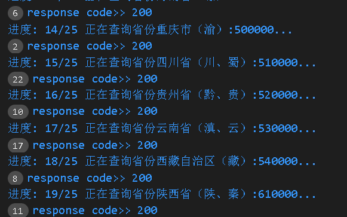

# golang获取最新行政区划信息

## 一、背景

在[乐琪药品流向数据查询管理系统（三）功能篇](https://www.qipanet.com/project/279.html)中有提到过系统支持自动更新行政区划信息，那怎么将省、市、区县信息按需随便更新呢？当时在网上找了很久，找到了一些公开的资料或者开源的小项目，有的很久没维护，有的是区域信息错漏百出，总之没找到适合我们使用的，靠别人的都不太靠谱。既然找不到，那就自己造个轮子吧！反正自己项目也是需要用到的。

## 二、原理

在==民政部==官网上（xzqh.mca.gov.cn），可以查询到各省行政区划信息，但是却不提供文件下载，需要一个个手动查询。3202的今天，竟然不给人下载数据，有点理解不了。抽查了几个近年有变更的区域，发现数据还挺准的，毕竟是国家级网站，还是有一定的权威性，比那些阿猫阿狗的付费接口精准多了。

抓包分析了下发现查询接口还是比较简陋的，于是做了个简单的爬虫模块，丢到quartz里做定时任务，就实现了定时更新行政区划信息，整个过程还是比较简单的。

## 三、开源

这么个小需求，网上竟找不到合适的解决方法，于是做完这个模块后就想着把它开源出来，希望能帮助到有需要的同学。但是这个模块是在spring boot项目里用的，不方便拿出来，因此用golang写了个简单的爬虫程序，自动下载全国各省份（暂不包含台湾省）的行政区划数据。

`main.exe`为主程序，直接运行即可输出的文件有json、csv两种格式的数据，路径为主程序根目录。==在使用时请做好延时处理，避免采集过于频繁导致网站崩溃！==

> 爬虫模块在实际项目中仅每个月使用一次，如有侵权请联系我删除！

## 四、演示

* 采集过程显示进度

  

* json格式

## 五、其他

- 源码：https://github.com/root6819/usgApiWithGo
- 微信 root6819 
